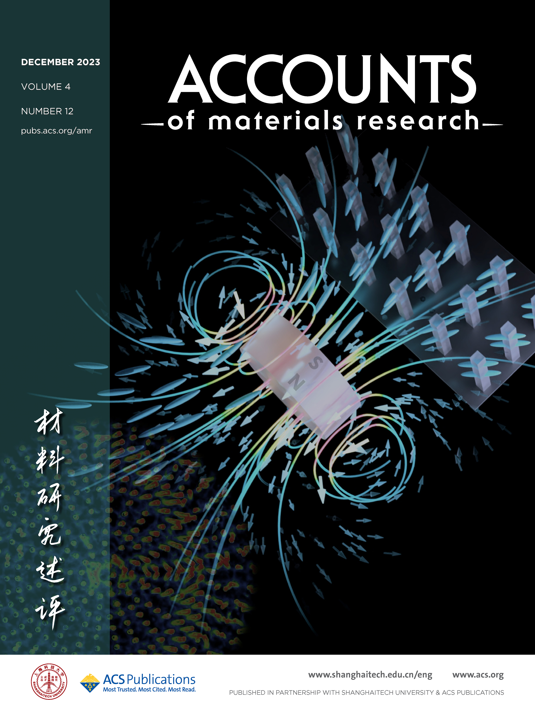

    
    

  For a full list of publications, please see my 
  <a href="https://scholar.google.com/citations?user=JuQrSfgAAAAJ&hl=en&oi=ao" target="_blank" rel="noopener">
    Google Scholar profile
  </a>.

